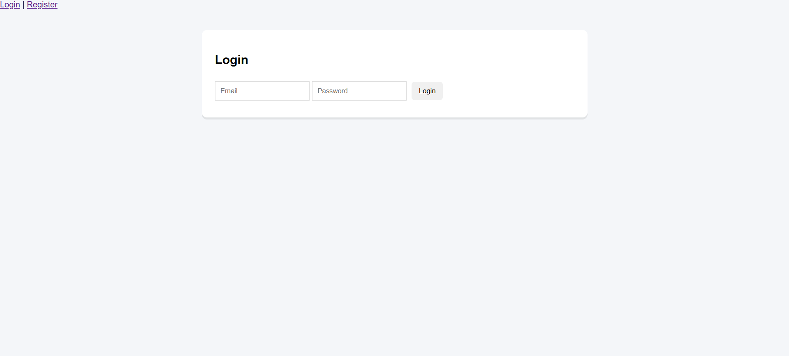
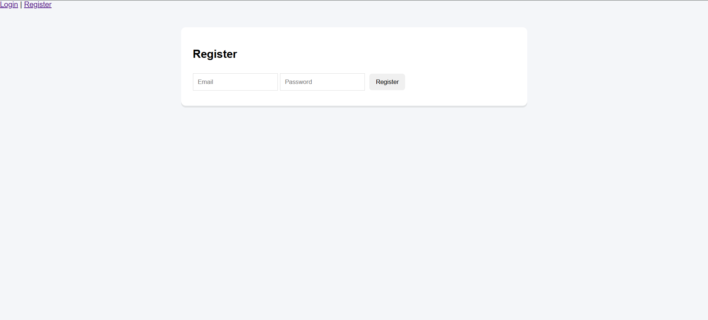
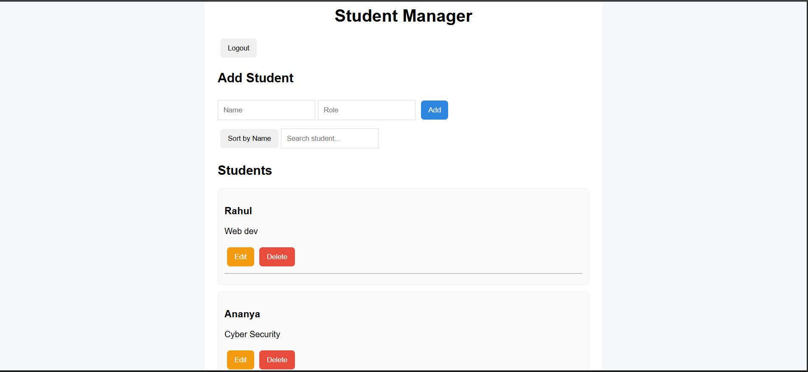
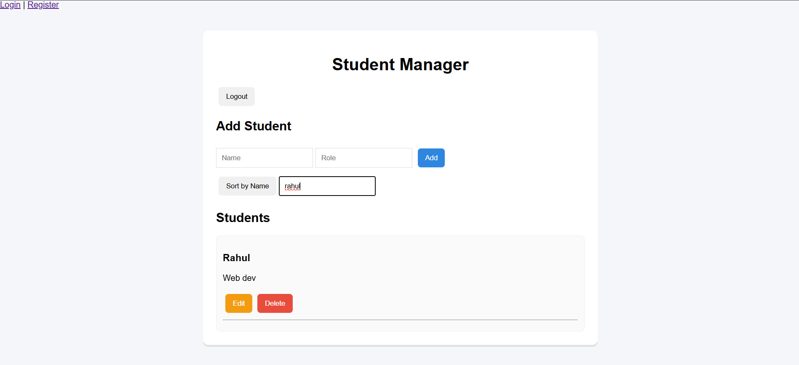

# MERN Student Manager App

A full-stack MERN application with authentication and user-specific student management.

## 🌐 Live Demo

Frontend: https://mern-student-manager.vercel.app  
Backend API: https://student-manager-backend-ev5m.onrender.coms

## 🚀 Features

- User Registration and Login (JWT authentication)
- Protected Dashboard
- Add and Delete Students
- User-specific data (each user sees only their students)
- Search and Sort functionality
- MongoDB persistence

---

## 🛠 Tech Stack

### Frontend
- React
- React Router
- Fetch API

### Backend
- Node.js
- Express
- MongoDB + Mongoose
- JWT Authentication
- bcrypt password hashing

---

## 📂 Project Structure

mern-student-manager/
│
├── client/   → React frontend  
└── server/   → Node/Express backend  

---

## ⚙️ How to Run Locally

### 1️⃣ Clone repo

git clone <repo-link>

### 2️⃣ Backend setup

cd server
npm install
npm start

Create `.env` file inside `server/`:

MONGO_URI=your_mongo_uri
JWT_SECRET=your_secret
PORT=5000

---

### 3️⃣ Frontend setup

cd client
npm install
npm start

Frontend runs on:

http://localhost:3000

Backend runs on:

http://localhost:5000

---

## 🎯 Future Improvements

- Edit student feature
- UI polish / dashboard layout
- Deployment (Vercel + Render)
- Role-based access

---

## 👨‍💻 Author

Built as part of MERN stack learning and portfolio preparation.

## 📸 Screenshots

### 🔐 Login Page

### 📝 Register Page

### 📊 Dashboard

### 🔎 Search & Sort
